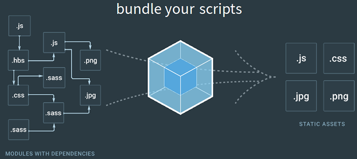

class: center, middle

# Webpack & diaporama web

---

## Diaporamas web

<div id="diaporamasWeb"></div>

---

## Webpack



* producteur d'**artefacts** pour le navigateur
* agrège les ressources comme des `modules`
* **[loaders](https://github.com/webpack/webpack#loaders)** : prétraitements `^(?!.*js)` -> modules `js` (import textuel, transpilage, templating, styles, composants)
* **[plugins](https://github.com/webpack/webpack#plugins)** : autres traitements de fichiers
  * fusion / morcellement de fichiers (js, sprites)
  * extraction / inclusion (html, css)

???

* Node.js : rassemble des modules ES, CommonJS, AMD
* typescript, image -> inline base64, CSS
* morcellement : pas de minification ni d'obfuscation pour les bibliothèques (vendors)

---

## Webpack-dev-server

* server web de développement pour webpack
* construit les fichiers statiques en mémoire
* rechargement à chaud

---

## Diaporama + webpack-dev-server = ?

* visualisation à la réalisation
--

* génération automatique des fichiers statiques
--

* scripts `npm`
  * PDF
  * déploiement
--

* **interactions** avec l'audience

---

# Démo 1

Configuration minimaliste webpack-Remark.js

## Dépendances

```sh
yarn add -D webpack webpack-dev-server raw-loader\
  html-webpack-plugin extract-text-webpack-plugin
```

## Tâches npm

```js
{
  // ...
  "scripts": {
    "build": "rm -rf dist && webpack",
    "start": "webpack-dev-server"
  },
  // ...
}
```

---

## Bilan démo 1

* externalisation du fichier `markdown`
* exposé sous forme de chaîne de caractères via un module
* génération d'un fichier `index.html` intégrant l'**artefact de compilation**...
--

  * il est **gros** !
--


???
* coloration syntaxique

---

## Démo 2

Isoler les modules métier JS des bibliothèques
* n'obfusquer que le nécessaire
* build incrémental -> plus rapide

---

## Bilan démo 2


---

## Démo 3

Pimp my slideshow
* stylage personnalisé
* polices
* images
  * copier ?
  * inclure dans le cycle de dépendances ?

---

### Mardown-image-loader
* le `raw-loader` :
  * ne distingue pas les références aux images
  * ne les inclut pas dans la chaîne de dépendances
--

* projet github [lucsorel/markdown-image-loader](https://github.com/lucsorel/markdown-image-loader) avec exemples de [setups Reveal.js et Remark.js](https://github.com/lucsorel/markdown-image-loader#web-based-slideshows)
--

* inspiré de l'article [Webpack: A simple loader](https://bocoup.com/blog/webpack-a-simple-loader) de [Michael "Z" Goddard](http://zfighting.tumblr.com/tagged/I-MADE-DIS) avec des améliorations :
  * en ES6
  * pour webpack 2/3+
  * distingue les références "fichiers" des URLs
  * cas d'utilisations et tests unitaires

---

Principes :
* tronçonne le fichier markdown selon ses références aux images (RegExp plutôt que par un parser)

```js
// détection des motifs ![...] (chemin/sans/http-s/vers/image)
const markdownImageReferencesRE =
  /(!\[[^\]]*\]\((?!(?:https?:)?\/\/)[^)]+\))/g
```

---

* les références sont transformées en dépendances de module
* le reste est **JSON-stringifié** (comme le `raw-loader` le faisait)

```js
// regexp similaire à la précédente avec des groupes de capture
const imagePathRE =
  /^(!\[[^\]]*\]\()((?!(?:https?:)?\/\/)[^)]+)(\))$/

const stgf = JSON.stringify

function requirifyImageReference(markdownImageReference) {
  const [, imgStart, imgPath, imgEnd ] =
      imagePathRE.exec(markdownImageReference) || []
  if (!imgPath) {
    return stgf(markdownImageReference)
  } else {
*    const imgRequest = loaderUtils.stringifyRequest(
*      this, // le loader et ses options
*      loaderUtils.urlToRequest(imgPath)
*    )

    return (
*      `${stgf(imgStart)}+require(${imgRequest})+${stgf(imgEnd)}`
    )
  }
}
```

---

* le tout est exporté comme un module :

```js
// exports the MarkdownImageLoader loader function
module.exports = function MarkdownImageLoader(mdContent = '') {
  // the outputs of this loader can be cached
  this.cacheable && this.cacheable()

  return `
module.exports = [
${mdContent.split(markdownImageReferencesRE)
  .map(requirifyImageReference)
  .join(',\n')}
].join('')`
}
```

---

* utilisation

```sh
yarn add -D mardown-image-loader
```

```js
// webpack.config.js

module.exports = {
  // ...
  module: {
    rules: [
      // ...
      {
*        test: /\.(png|jpe?g|gif|svg)$/,
*        use: 'file-loader?outputPath=img/'
      },
      {
*        test: /\.(md|markdown)$/,
*        use: 'markdown-image-loader'
      }
    ]
  },
  plugins: [ /*...*/ ]
}

```
---

## Bilan démo 3

* couple loader-plugin
* utilisation de hash dans les noms de fichiers générés (cache)
* `markdown-image-loader` transforme les références aux images en modules requis

---

Questions

* story telling à améliorer ?
* quid de la police de caractère ?
